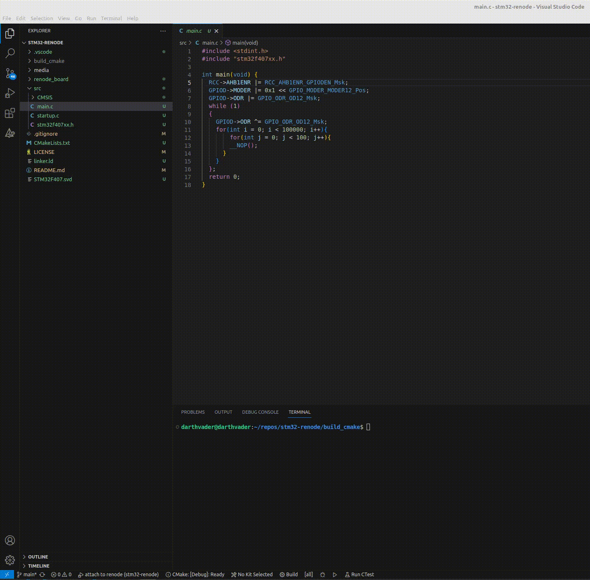

# Setting up Renode for STM32 Baremetal Development
This repository provides a basic structure for setting up Renode simulation for STM32 baremetal development. Renode is a versatile open-source framework for simulating and testing embedded systems, making it an excellent tool for developing and testing embedded applications in a controlled environment.

# Prerequisites
Before you begin, ensure you have the following tools installed:

- [Renode](https://renode.io/)
- [CMake](https://cmake.org/)
- [GCC ARM Toolchain](https://developer.arm.com/downloads/-/gnu-rm)
- gdb-multiarch

**NOTE:**  We use Linux based OS for development. If you are on Windows you can use Windows Subsytem for Linux( WSL ).

# Repository Structure

- **CMakeLists.txt**: CMake configuration file for building the project.
- **.gitignore**: Git ignore file for specifying files and folders to be excluded from version control.
- **LICENSE**: The license under which this project is distributed.
- **linker.ld**: Linker script for the STM32 application.
- **README.md**: You are reading it right now! Instructions for setting up and using the repository.
- **renode_board**: A folder containing Renode platform description scripts for the STM32 board.
- **src**: Source code folder for your STM32 baremetal application.
- **STM32F407.svd**: STM32 System View Description (SVD) file for peripherals and registers description.
- **.vscode**: Configuration folder for Visual Studio Code settings (optional).

<a id="user-configuration"></a>
# User configuration

There are certain places that user needs to modify based on their configuration

- **.vscode/launch.json**
   
   User needs to update the binary name based on the target name they choose in CmakeLists.txt
- **CmakeLists.txt**
  
  User needs to choose a target name the default one is lab1. Also user needs to update variable 
  **CMAKE_C_COMPILER** based on their **arm-none-eabi-gcc** installation path.

- **renode-board/stm32f4_discovery.resc**
  
   User needs to update the binary name based on the target name they choose in CmakeLists.txt

We have marked all these things as to-do in the code as well

# Building the project

We use Cmake as the build generator for this project. I've extensively discussed the advantages of CMake, which you can explore in-depth through the article titled  [Why I Don't Write Makefiles Anymore!](https://inpyjama.com/beyond-make-why-i-dont-write-makefiles/) available at [inpyjama](https://inpyjama.com/).

The CMake script is set up to incorporate all ***.c** and ***.s** files located under **src** folder into the build configuration. So you don't need to update the  Additionally, it adds the directories **src/** and **src/CMSIS/Include** in the include path.

Once the user has addressed all the TO-DO's mentioned in the [User configuration](#user-configuration), we are ready to build our project.

To generate the build configuration, execute the following command:
```
cmake -D CMAKE_BUILD_TYPE=Debug -B ./build_cmake -S ./
```

This command will create a directory named build_cmake containing all the necessary makefiles to build the target automatically.

To build the target run the following commands
```
cd build_cmake
make <target_name specified in CMakeLists.txt>
```

For cleaning the target, you can utilize the command:
```
make clean
```

**NOTE**:  You need to run cmake only once. Subsequent calls to make will automatically call cmake.

# Running renode
Steps from now on assume that you are running **renode** from **build_cmake** directory. This is a known limitation right now. I will fix it as I learn more about renode-monitor and how to export env variables to it.

To launch renode use the follwong command from build_cmake directory
```
renode --console
``` 

Once within the Renode monitor interface, you can initialize the STM32 machine by executing the command provided below:

```
i @../renode_board/stm32f4_discovery.resc
```

Currently, the binary has been loaded, and a gdb-server is operational on port 1234. However, the machine is in a halted state, awaiting a gdb connection.

To establish a connection with the machine, navigate to the "Run and Debug" section located on the left side of Visual Studio Code, and then click the play button at the top as shown in gif below.



To shut down renode simply run ```Clear``` in the renode-monitor terminal

***We will try to cover renode in more details, Stay Tuned!!!!***

Don't hesitate to contact me on LinkedIn if you require further information.

[ Rajat Batra](https://www.linkedin.com/in/rajat-batra-a88124126/)
